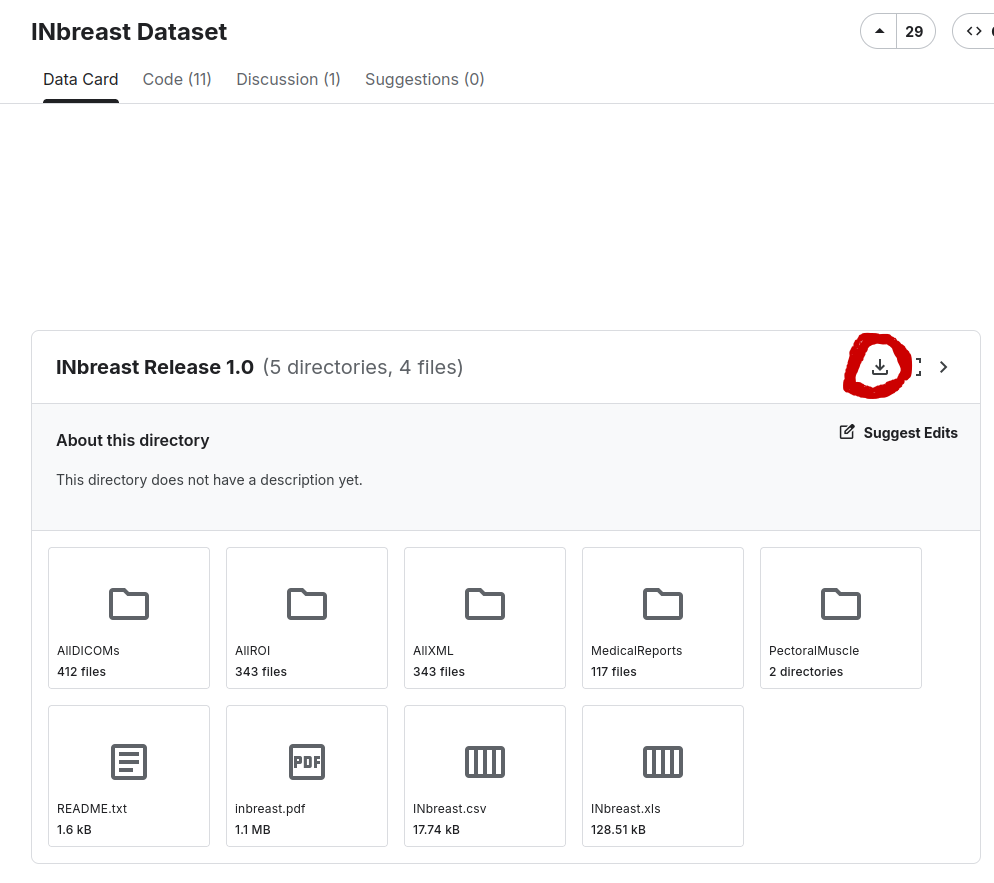

# Breast Cancer Analysis

Reproducible mammogram classification pipeline for the INbreast dataset. The
project is organized around reusable Python modules in `pipeline/` and a small
set of entrypoints for preprocessing, training, orchestration, and evaluation.

## Start Here

- Quick start: [`docs/quickstart.md`](docs/quickstart.md)
- Unattended execution: [`docs/unattended_execution.md`](docs/unattended_execution.md)
- Setup details: [`docs/setup.md`](docs/setup.md)
- Testing and smoke checks: [`docs/testing.md`](docs/testing.md)
- GPU validation: [`docs/gpu.md`](docs/gpu.md)
- WSL GPU setup: [`docs/wsl_gpu_setup.md`](docs/wsl_gpu_setup.md)
- Troubleshooting: [`docs/troubleshooting.md`](docs/troubleshooting.md)
- Main config: [`configs/experiment.default.json`](configs/experiment.default.json)
- Local dashboard: [`experiment_dashboard.py`](experiment_dashboard.py)
- Paper source: [`article/main.tex`](article/main.tex)

## Main Workflow

### Quick Unattended Setup

For a fully automated setup:

```bash
python3 scripts/unattended_setup.py --gpu auto
```

This will bootstrap the environment, validate the dataset, run smoke tests, and preprocess the data.

Verify readiness before launching experiments:

```bash
python3 scripts/check_readiness.py
```

### Manual Workflow

1. Put the INbreast dataset under `data/INbreast Release 1.0/`.
2. Bootstrap the project environment.
3. Run `python preprocess.py`.
4. Run the experiment queue with `python run_experiments.py launch`.
5. Generate the consolidated report with `python evaluate.py`.

## Minimal Setup

Install the OS packages first. On Debian/Ubuntu:

```bash
sudo apt update
sudo apt install python3 python3-venv python3-pip build-essential python3-dev
```

Then bootstrap the project environment:

```bash
python3 scripts/bootstrap_env.py --gpu auto
```

Use `--gpu required` when the run must use TensorFlow on GPU and should fail fast
otherwise. Add `--dev` to install test and formatting dependencies too.

After bootstrapping, either activate `.venv` or call `./.venv/bin/python`
directly.

Supported Python range: 3.10, 3.11, or 3.12.

For development checks:

```bash
./.venv/bin/python scripts/check_environment.py --require-venv
./.venv/bin/python scripts/validate_dataset.py
./.venv/bin/python scripts/check_gpu.py
./.venv/bin/python scripts/check_runtime.py --device auto
./.venv/bin/python scripts/smoke_run.py
./.venv/bin/python scripts/validate_long_runner.py --combinations 20 --device cpu
./.venv/bin/python -m ruff check .
./.venv/bin/python -m black --check .
./.venv/bin/python -m pytest
```

Get the full dataset here:



## Expected Dataset layout

```text
data/INbreast Release 1.0/
  INbreast.csv
  AllDICOMs/*.dcm
```

## Key Outputs

- Processed images and splits: `artifacts/processed/`
- Training history and predictions: `artifacts/runs/`
- Iterative runner state, logs, and summary: `artifacts/experiments/`
- Final evaluation report: `artifacts/reports/final_comprehensive_results.csv`

The quick start guide has the exact commands for running, stopping, resuming,
and resetting the experiment queue. The default experiment grid can take hours.
Default validation should use smoke/memory checks first (`smoke_run.py`,
`validate_long_runner.py`, and targeted pytest suites). CPU-only execution is
supported; GPU is optional unless a command uses `--require-gpu`. If a run
fails after several combinations, inspect `iterative-runner.log`,
`runner_state.json`, `experiment_runs.csv`, and the per-task snapshots under
`artifacts/experiments/tasks/`.
